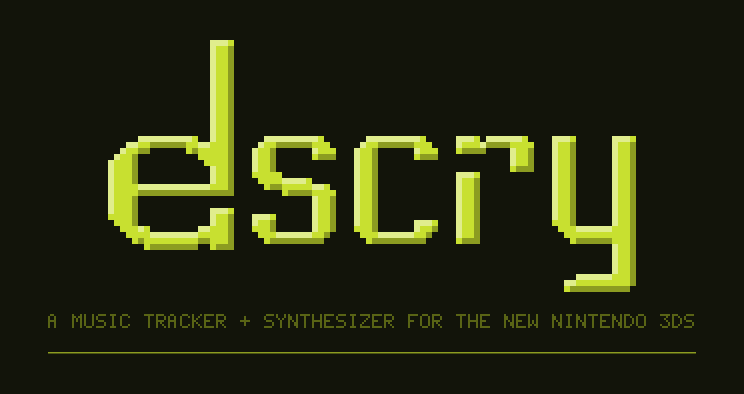
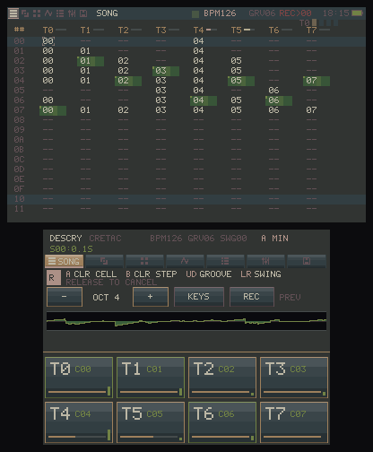
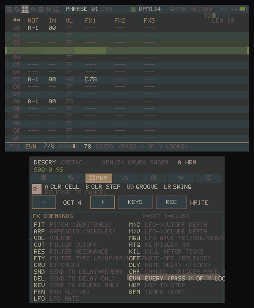
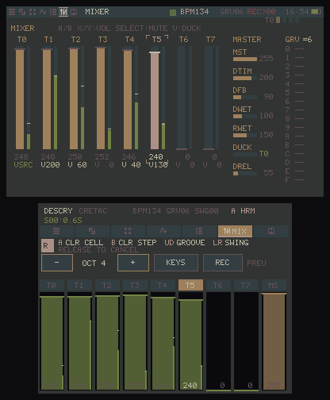
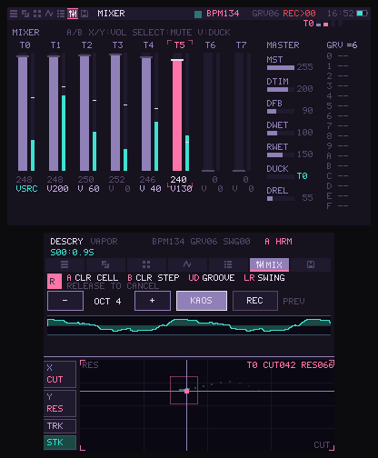
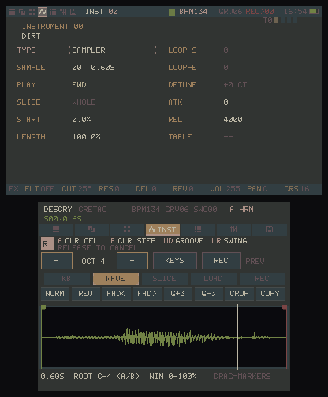
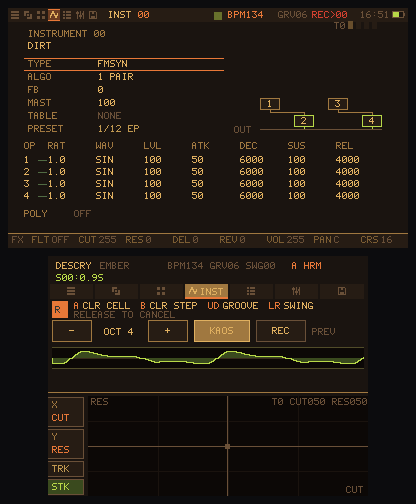
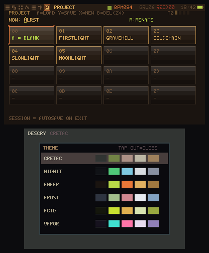
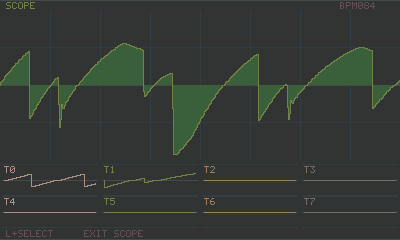

<p align="center"></p>

native homebrew, fixed-point DSP, built-in mic sampler. everything runs on the device.

> *descry* (v.) — to catch sight of something distant or hidden; to discern.

**new here? read the [user guide](docs/GUIDE.md)** — quickstart, the data
model, every screen, all FX commands, sampling and performance tricks.

## what it is

descry is a portable tracker in the tradition of [LSDj](https://www.littlesounddj.com),
[Dirtywave M8](https://dirtywave.com) and the discontinued Korg DSN-12: song → chain → phrase
hierarchy, hex editing, a set of synth engines, and the 3DS touchscreen for live input.

it needs a **New** 3DS/2DS — the synth uses the faster CPU and the extra core.
old 3DS is not supported.

## screenshots



| | |
| --- | --- |
|  |  |
|  |  |
|  |  |



## features

**sequencer**
- song (256 rows × 8 tracks) → chain (16 rows + transpose) → phrase (16 steps)
- phrase steps: note · instrument · velocity · 3 FX columns
- 23 FX commands (pitch, arp, retrig, delay, kill, filter, sends, LFO, chance,
  conditional trigger, hop, tempo...) with a built-in reference: press SELECT on
  an FX column to open the command list
- per-instrument mod tables (3 FX lanes × 16 rows, adjustable tick rate)
- groove patterns (ticks per step) and swing
- key/scale snap for the touch keyboard (11 scales)
- per-phrase length for polymetry
- live mode: quantized chain launch per track, solo pads
- clone (deep copy) for chains and phrases, undo/redo, block selection copy/paste

**instruments** (all fixed-point, 32 kHz)
- wavsynth — classic waves with unison/detune, plus user wavetables
  (drop single-cycle WAVs on the SD card)
- FM — 4 operators, 8 algorithms, feedback, per-op ADSR and waveform
- sampler — chops/slices, loop modes, WAV loader with folder browser
- drumkit — 16 pads → 16 sample slots
- DSN voice — 2 VCO / VCF / 2 EG / 2 MG analog-style voice
- preset banks for each engine

**mixing / performance**
- 8 tracks × 4 voices, per-track filter (LPF/HPF/BPF/notch), bitcrush,
  downsample, LFO routing, pan
- global ping-pong delay + reverb, sidechain duck, soft-clip master with DC blocker
- mixer view with touch faders, meters and peak hold
- KAOSS-style XY pad: two assignable destinations, per-track or all tracks at
  once, parameters ramp back on release
- analog sticks mirror the XY pad (left stick = the same assignable pair,
  right stick = sends/crush); can be toggled off

**sampling**
- record from the built-in mic straight into a sample slot (hold ZR)
- 12 procedural drum/tone generators — build a kit with no files at all
- sample editor: trim, normalize, reverse, fades, chop, copy

**misc**
- 6 color themes (tap the DESCRY logo to pick)
- fullscreen oscilloscope (L+SELECT)
- screenshots to SD (R+SELECT, saves both screens as BMP)
- battery + clock in the header, autosave on exit

## controls

| input | action |
| --- | --- |
| D-pad | move cursor |
| A / B | edit value ±1 · X / Y — ±16 (context-dependent) |
| L / R (tap) | previous / next view |
| L + D-pad | BPM · R + ↑↓ groove · R + ←→ swing |
| ZL + X / Y | copy / paste · ZL + B / A — undo / redo |
| ZL + SELECT | clone (song/chain) · selection mode (phrase) |
| SELECT | preview note · FX command list (on FX columns) |
| L + SELECT | fullscreen oscilloscope |
| R + SELECT | screenshot → SD |
| ZR (hold) | mic record |
| START | play / stop · SELECT + START — exit |
| touch | keyboard / pads / XY pad / faders / tabs |

## install

grab the [latest release](https://github.com/patausx/descry/releases/latest):

- **CIA** (recommended on CFW) — install `descry.cia` with FBI; the app gets its
  own home menu icon + banner
- **3DSX** — unzip `descry-v1.0.0.zip`, copy the `3ds` folder to the SD card
  root, launch from the Homebrew Launcher
- `descry.3ds` — CCI for flashcarts

the zip also carries five demo projects and a starter pack of single-cycle
wavetables — worth grabbing even if you install the CIA.

## build

requires devkitPro with the 3DS toolchain:

```sh
sudo (dkp-)pacman -S 3ds-dev
make        # descry.3dsx
make cia    # descry.cia (needs makerom + bannertool on PATH)
make cci    # descry.3ds
```

produces `descry.3dsx` — copy to `/3ds/descry/` on the SD card and launch from
the homebrew launcher.

## files on SD

everything lives under `sdmc:/3ds/descry/`:
- `session.tr3d` — autosaved session
- `project_XX.tr3d` — 16 save slots
- `sample_XX.s16` — recorded/loaded samples
- `wav/` — put your own WAVs here (subfolders work)
- `wavetable/` — single-cycle WAVs for the wavsynth USER shape
- `screens/` — screenshots
- `render.wav` — song export

## architecture

```
core/          # platform-independent (also builds on x86 for testing)
  audio/       # fixed-point math, mixer, voices, reverb
  dsp/         # SVF filter, LFO
  synth/       # wavsynth, fm, sampler, drumkit, dsn, mic, wav loader
  sequencer/   # types, project, player, serialization, FX
  ui/          # views, navigation, editing, themes
platform/3ds/  # libctru, ndsp audio, citro2d, mic
tools/         # host-side demo generators and render/analysis helpers
```

## license

GPL-3.0 — see [LICENSE](LICENSE).

made by patausx. inspired by LSDj, the M8 and the DSN-12.
not affiliated with Dirtywave, Nintendo or Korg.
